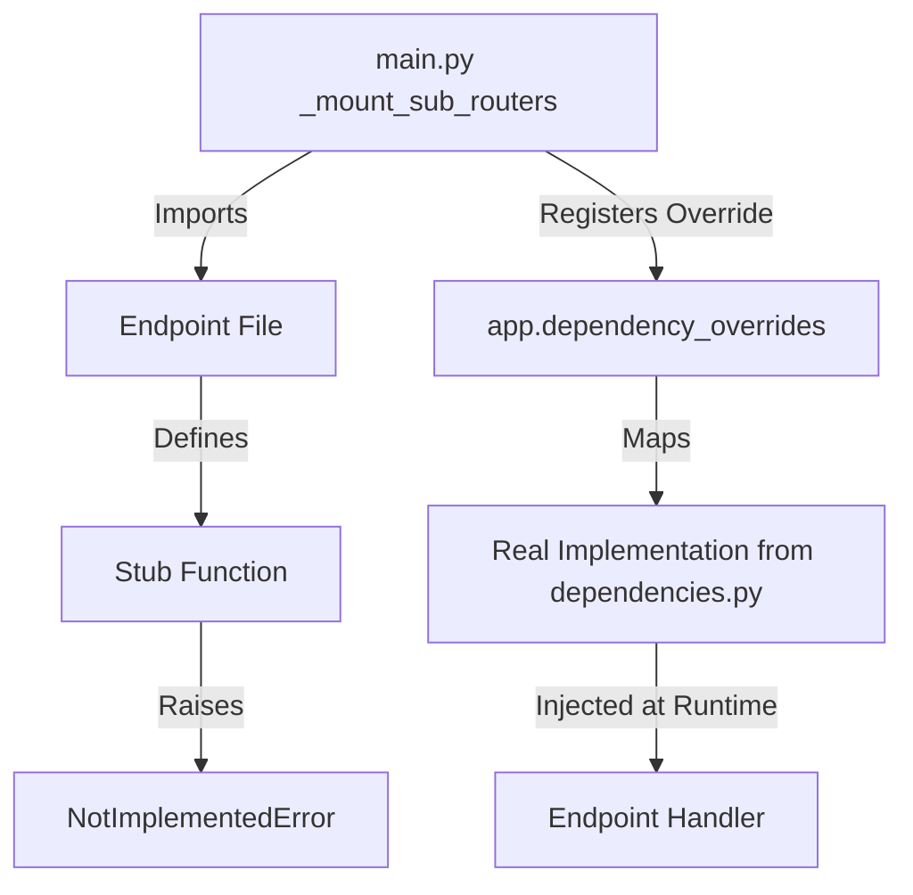

# Dependency Injection Fix Design Document

## Executive Summary

The JobHuntin codebase has **111 occurrences** of `NotImplementedError` stubs across **40+ API endpoint files**. These stubs are designed to be overridden via FastAPI's `dependency_overrides` mechanism in [`apps/api/main.py`](apps/api/main.py). While the current implementation works, it has several critical issues:

1. **Runtime failures** if dependency overrides are missing
2. **No compile-time safety** - errors only discovered at runtime
3. **High maintenance burden** - each new module requires manual registration
4. **Inconsistent patterns** - multiple stub implementation styles

---

## Current State Analysis

### Files with NotImplementedError Stubs

| File | Stub Count | Dependencies |
|------|------------|--------------|
| [`apps/api/ab_testing.py`](apps/api/ab_testing.py) | 2 | `_get_pool`, `_get_tenant_ctx` |
| [`apps/api/admin.py`](apps/api/admin.py) | 3 | `_get_pool`, `_get_tenant_ctx`, `_get_admin_user_id` |
| [`apps/api/admin_security.py`](apps/api/admin_security.py) | 3 | `_get_pool`, `_get_user_id`, `_get_tenant_id` |
| [`apps/api/agent_improvements_endpoints.py`](apps/api/agent_improvements_endpoints.py) | 3 | `get_tenant_context`, `_get_pool`, `get_agent_improvements_manager` |
| [`apps/api/ai.py`](apps/api/ai.py) | 3 | `_get_pool`, `_get_user_id`, `_get_tenant_id` |
| [`apps/api/ai_onboarding.py`](apps/api/ai_onboarding.py) | 2 | `_get_pool`, `_get_tenant_ctx` |
| [`apps/api/ats_recommendations.py`](apps/api/ats_recommendations.py) | 2 | `_get_pool`, `_get_tenant_ctx` |
| [`apps/api/bulk.py`](apps/api/bulk.py) | 2 | `_get_pool`, `_get_tenant_ctx` |
| [`apps/api/calendar_api.py`](apps/api/calendar_api.py) | 3 | `_get_pool`, `_get_user_id`, `_get_tenant_id` |
| [`apps/api/career.py`](apps/api/career.py) | 2 | `_get_pool`, `_get_user_id` |
| [`apps/api/communication_endpoints.py`](apps/api/communication_endpoints.py) | 2 | `_get_pool`, `get_tenant_context` |
| [`apps/api/communications_endpoints.py`](apps/api/communications_endpoints.py) | 1 | `get_tenant_context` |
| [`apps/api/compliance_reports.py`](apps/api/compliance_reports.py) | 2 | `_get_admin_user_id`, `_get_pool` |
| [`apps/api/concurrent_usage_endpoints.py`](apps/api/concurrent_usage_endpoints.py) | 1 | `get_tenant_context` |
| [`apps/api/core_routes.py`](apps/api/core_routes.py) | 3 | `_get_pool`, `_get_user_id`, `_get_tenant_ctx` |
| [`apps/api/dashboard.py`](apps/api/dashboard.py) | 3 | `_get_pool`, `_get_tenant_ctx`, `_get_admin_user_id` |
| [`apps/api/developer.py`](apps/api/developer.py) | 2 | `_get_pool`, `_get_tenant_ctx` |
| [`apps/api/dlq_endpoints.py`](apps/api/dlq_endpoints.py) | 4 | `get_tenant_context`, `_get_pool`, `_get_tenant_ctx`, `_get_admin_user_id` |
| [`apps/api/document_tracking_endpoints.py`](apps/api/document_tracking_endpoints.py) | 1 | `get_tenant_context` |
| [`apps/api/export.py`](apps/api/export.py) | 2 | `_get_pool`, `_get_tenant_ctx` |
| [`apps/api/growth.py`](apps/api/growth.py) | 3 | `_get_pool`, `_get_user_id`, `_get_admin_user_id` |
| [`apps/api/integrations.py`](apps/api/integrations.py) | 3 | `_get_pool`, `_get_user_id`, `_get_tenant_id` |
| [`apps/api/interviews.py`](apps/api/interviews.py) | 2 | `_get_pool`, `_get_user_id` |
| [`apps/api/job_alerts.py`](apps/api/job_alerts.py) | 2 | `_get_pool`, `_get_tenant_ctx` |
| [`apps/api/job_details.py`](apps/api/job_details.py) | 2 | `_get_pool`, `_get_tenant_ctx` |
| [`apps/api/llm_career_path.py`](apps/api/llm_career_path.py) | 2 | `_get_pool`, `_get_tenant_ctx` |
| [`apps/api/marketplace.py`](apps/api/marketplace.py) | 2 | `_get_pool`, `_get_tenant_ctx` |
| [`apps/api/match_calibration.py`](apps/api/match_calibration.py) | 2 | `_get_pool`, `_get_tenant_ctx` |
| [`apps/api/match_weights.py`](apps/api/match_weights.py) | 2 | `_get_pool`, `_get_tenant_ctx` |
| [`apps/api/mfa.py`](apps/api/mfa.py) | 2 | `_get_pool`, `_get_user_id` |
| [`apps/api/oauth_endpoints.py`](apps/api/oauth_endpoints.py) | 1 | `get_tenant_context` |
| [`apps/api/og.py`](apps/api/og.py) | 1 | `get_tenant_context` |
| [`apps/api/performance_metrics_endpoints.py`](apps/api/performance_metrics_endpoints.py) | 1 | `get_tenant_context` |
| [`apps/api/resume_integration.py`](apps/api/resume_integration.py) | 2 | `_get_pool`, `_get_tenant_ctx` |
| [`apps/api/resume_pdf.py`](apps/api/resume_pdf.py) | 2 | `_get_pool`, `_get_tenant_ctx` |
| [`apps/api/saved_jobs.py`](apps/api/saved_jobs.py) | 3 | `_get_pool`, `_get_user_id`, `_get_tenant_ctx` |
| [`apps/api/screenshot_endpoints.py`](apps/api/screenshot_endpoints.py) | 1 | `get_tenant_context` |
| [`apps/api/sessions.py`](apps/api/sessions.py) | 3 | `_get_pool`, `_get_tenant_ctx`, `_get_user_id` |
| [`apps/api/skill_gap_analysis.py`](apps/api/skill_gap_analysis.py) | 2 | `_get_pool`, `_get_tenant_ctx` |
| [`apps/api/skills.py`](apps/api/skills.py) | 2 | `_get_pool`, `_get_tenant_ctx` |
| [`apps/api/sso.py`](apps/api/sso.py) | 2 | `_get_pool`, `_get_tenant_ctx` |
| [`apps/api/user.py`](apps/api/user.py) | 2 | `_get_pool`, `_get_tenant_ctx` |
| [`apps/api/user_experience_endpoints.py`](apps/api/user_experience_endpoints.py) | 2 | `_get_pool`, `_get_tenant_ctx` |
| [`apps/api/voice_interviews.py`](apps/api/voice_interviews.py) | 2 | `_get_pool`, `_get_tenant_ctx` |
| [`apps/api/worker_health.py`](apps/api/worker_health.py) | 2 | `_get_tenant_ctx`, `_get_pool` |

### Current DI Pattern

The codebase uses FastAPI's `dependency_overrides` mechanism:



#### Stub Implementation Patterns

**Pattern 1: Simple raise** - Most common
```python
async def _get_pool():
    raise NotImplementedError("Pool dependency not injected")
```

**Pattern 2: Generator throw trick** - Used for type hints
```python
def _get_pool() -> asyncpg.Pool:
    return (_ for _ in ()).throw(NotImplementedError("Pool not injected"))
```

#### Override Registration in main.py

```python
# From apps/api/main.py lines 572-925
def _mount_sub_routers() -> None:
    import api.saved_jobs as saved_jobs_mod
    
    app.dependency_overrides[saved_jobs_mod._get_pool] = get_pool
    app.dependency_overrides[saved_jobs_mod._get_user_id] = get_current_user_id
    app.dependency_overrides[saved_jobs_mod._get_tenant_ctx] = get_tenant_context
    app.include_router(saved_jobs_mod.router)
```

### Real Implementations Location

The actual dependency implementations are in [`apps/api/dependencies.py`](apps/api/dependencies.py):

| Function | Purpose |
|----------|---------|
| `get_pool()` | Returns the asyncpg database pool |
| `get_read_pool()` | Returns read replica pool or falls back to primary |
| `get_current_user_id()` | Extracts user ID from JWT token |
| `require_admin_user_id()` | Validates user is system admin |
| `get_tenant_id()` | Resolves tenant_id for current user |
| `get_current_user()` | Returns user as dict |

---

## Identified Issues

### 1. Missing Override Detection

If a new endpoint module is created but not registered in `_mount_sub_routers()`, the endpoints will crash at runtime with `NotImplementedError`. There is no compile-time or startup-time validation.

### 2. Inconsistent Stub Patterns

Two different patterns for stubs create confusion:
- Simple `raise NotImplementedError` - loses type information
- Generator throw trick - preserves types but is obscure

### 3. Manual Registration Burden

Every module requires 3-5 lines of boilerplate in `main.py`:
```python
app.dependency_overrides[module._get_pool] = get_pool
app.dependency_overrides[module._get_tenant_ctx] = get_tenant_context
app.include_router(module.router)
```

### 4. Naming Inconsistencies

- Some files use `_get_tenant_ctx`, others use `get_tenant_context`
- Some use `_get_user_id`, others have no user ID dependency
- DLQ endpoints has both `get_tenant_context` and `_get_tenant_ctx`

### 5. No Test Safety

Tests must manually override dependencies or use the full app context. Missing overrides cause cryptic `NotImplementedError` rather than clear dependency injection errors.

---

## Recommended Solution

### Option A: Centralized Dependency Injection Module (Recommended)

Create a single source of truth for dependencies that endpoint files import directly.

#### Implementation

**Step 1: Create `apps/api/deps.py` with re-exports**

```python
"""Centralized dependency exports for API endpoints.

All endpoint files should import from this module rather than
defining local stub functions.

Usage:
    from api.deps import get_pool, get_tenant_context, get_current_user_id
"""

from api.dependencies import (
    get_pool,
    get_read_pool,
    get_current_user_id,
    require_admin_user_id,
    get_tenant_id,
    get_current_user,
    _pool_manager,
)

# Re-export TenantContext for type hints
from packages.backend.domain.tenant import TenantContext

# Convenience alias for tenant context resolver
async def get_tenant_context(
    user_id: str = Depends(get_current_user_id),
    db: asyncpg.Pool = Depends(get_pool),
) -> TenantContext:
    """Resolve TenantContext from JWT user_id."""
    from packages.backend.domain.tenant import resolve_tenant_context
    from fastapi import HTTPException
    from shared.logging_config import get_logger, LogContext
    
    logger = get_logger("sorce.api.deps")
    
    try:
        async with db.acquire() as conn:
            ctx = await resolve_tenant_context(conn, user_id)
        if ctx is None:
            raise HTTPException(status_code=500, detail="Failed to resolve tenant context")
        LogContext.set(tenant_id=ctx.tenant_id, user_id=ctx.user_id)
        return ctx
    except HTTPException:
        raise
    except Exception as exc:
        logger.error("Error resolving tenant context: %s", exc, exc_info=True)
        raise HTTPException(status_code=500, detail="Failed to resolve tenant context")
```

**Step 2: Update endpoint files to use centralized imports**

Before:
```python
# apps/api/saved_jobs.py
async def _get_pool():
    raise NotImplementedError("Pool dependency not injected")

async def _get_user_id() -> str:
    raise NotImplementedError("User ID dependency not injected")

async def _get_tenant_ctx() -> TenantContext:
    raise NotImplementedError("Tenant context dependency not injected")

@router.post("")
async def save_job(
    user_id: str = Depends(_get_user_id),
    ctx: TenantContext = Depends(_get_tenant_ctx),
    db: asyncpg.Pool = Depends(_get_pool),
):
    ...
```

After:
```python
# apps/api/saved_jobs.py
from api.deps import get_pool, get_current_user_id, get_tenant_context

@router.post("")
async def save_job(
    user_id: str = Depends(get_current_user_id),
    ctx: TenantContext = Depends(get_tenant_context),
    db: asyncpg.Pool = Depends(get_pool),
):
    ...
```

**Step 3: Simplify main.py**

```python
# apps/api/main.py
def _mount_sub_routers() -> None:
    """Mount sub-routers without manual dependency overrides.
    
    Dependencies are now imported directly from api.deps by endpoint modules.
    """
    import api.saved_jobs as saved_jobs_mod
    app.include_router(saved_jobs_mod.router)
    
    import api.admin as admin_mod
    app.include_router(admin_mod.router)
    
    # ... etc - no more dependency_overrides boilerplate
```

#### Benefits

1. **No runtime crashes** - Missing imports cause immediate ImportError
2. **Type safety** - IDE and mypy can verify dependency usage
3. **Single source of truth** - All dependencies defined in one place
4. **Simplified main.py** - No manual override registration
5. **Better testability** - Tests can override at the source

#### Migration Strategy

1. Create `apps/api/deps.py` with all dependency exports
2. Update endpoint files one at a time to use centralized imports
3. Remove stub functions from each endpoint file
4. Remove corresponding `dependency_overrides` from `main.py`
5. Run tests after each file migration

---

### Option B: Dependency Injection Container

Use a DI container library like `dependency-injector` for more complex scenarios.

#### Pros
- More explicit dependency management
- Better for complex dependency graphs
- Supports scoped dependencies

#### Cons
- Additional dependency
- Steeper learning curve
- More boilerplate than Option A
- Overkill for current needs

---

### Option C: FastAPI Built-in Depends with Protocol Classes

Define Protocol classes for dependencies and use FastAPI's built-in injection.

```python
# apps/api/protocols.py
from typing import Protocol

class DatabasePool(Protocol):
    async def acquire(self) -> asyncpg.Connection: ...

class TenantResolver(Protocol):
    async def __call__(self, user_id: str) -> TenantContext: ...
```

#### Pros
- Type-safe
- Explicit interfaces
- Good for testing with mocks

#### Cons
- More boilerplate
- Still requires override mechanism
- Doesn't solve the registration problem

---

## Recommended Implementation Plan

### Phase 1: Create Centralized Dependency Module

1. Create [`apps/api/deps.py`](apps/api/deps.py) with all dependency exports
2. Add `get_tenant_context` implementation (move from main.py)
3. Add type hints and documentation

### Phase 2: Migrate Endpoint Files

Migrate endpoint files in batches by dependency pattern:

**Batch 1: Standard pattern** - `_get_pool`, `_get_tenant_ctx`
- ab_testing.py, ai_onboarding.py, ats_recommendations.py, bulk.py
- dashboard.py, developer.py, export.py, job_alerts.py, job_details.py
- llm_career_path.py, marketplace.py, match_calibration.py, match_weights.py
- resume_integration.py, resume_pdf.py, skill_gap_analysis.py, skills.py
- sso.py, user.py, user_experience_endpoints.py, voice_interviews.py
- worker_health.py

**Batch 2: With user_id** - `_get_pool`, `_get_user_id`
- career.py, interviews.py, mfa.py, sessions.py

**Batch 3: With tenant_id** - `_get_pool`, `_get_user_id`, `_get_tenant_id`
- admin_security.py, calendar_api.py, integrations.py

**Batch 4: With admin_user_id** - `_get_pool`, `_get_admin_user_id`
- admin.py, compliance_reports.py, dashboard.py, growth.py

**Batch 5: Special cases**
- ai.py - has `_get_tenant_id` derived from context
- agent_improvements_endpoints.py - has manager dependency
- dlq_endpoints.py - has both naming conventions
- saved_jobs.py - has all three: pool, user_id, tenant_ctx

### Phase 3: Simplify main.py

1. Remove all `dependency_overrides` registrations
2. Keep only `include_router` calls
3. Remove `_mount_sub_routers` function if no longer needed

### Phase 4: Add Validation

1. Create startup check to verify all routers have correct dependencies
2. Add pre-commit hook to check for new NotImplementedError stubs
3. Update coding standards documentation

---

## Code Examples

### Before Migration

```python
# apps/api/saved_jobs.py - Current implementation
from __future__ import annotations

import asyncpg
from fastapi import APIRouter, Depends, HTTPException, status
from pydantic import BaseModel

from packages.backend.domain.tenant import TenantContext
from shared.logging_config import get_logger
from shared.validators import validate_uuid


async def _get_pool():
    raise NotImplementedError("Pool dependency not injected")


async def _get_user_id() -> str:
    raise NotImplementedError("User ID dependency not injected")


async def _get_tenant_ctx() -> TenantContext:
    raise NotImplementedError("Tenant context dependency not injected")


logger = get_logger("sorce.saved_jobs")
router = APIRouter(prefix="/saved-jobs", tags=["saved-jobs"])


@router.post("", response_model=SavedJobResponse, status_code=status.HTTP_201_CREATED)
async def save_job(
    request: SaveJobRequest,
    user_id: str = Depends(_get_user_id),
    ctx: TenantContext = Depends(_get_tenant_ctx),
    db: asyncpg.Pool = Depends(_get_pool),
) -> SavedJobResponse:
    ...
```

### After Migration

```python
# apps/api/saved_jobs.py - Migrated implementation
from __future__ import annotations

import asyncpg
from fastapi import APIRouter, Depends, HTTPException, status
from pydantic import BaseModel

from api.deps import get_pool, get_current_user_id, get_tenant_context
from packages.backend.domain.tenant import TenantContext
from shared.logging_config import get_logger
from shared.validators import validate_uuid


logger = get_logger("sorce.saved_jobs")
router = APIRouter(prefix="/saved-jobs", tags=["saved-jobs"])


@router.post("", response_model=SavedJobResponse, status_code=status.HTTP_201_CREATED)
async def save_job(
    request: SaveJobRequest,
    user_id: str = Depends(get_current_user_id),
    ctx: TenantContext = Depends(get_tenant_context),
    db: asyncpg.Pool = Depends(get_pool),
) -> SavedJobResponse:
    ...
```

### main.py Before

```python
# apps/api/main.py - Current implementation (lines 840-845)
import api.saved_jobs as saved_jobs_mod

app.dependency_overrides[saved_jobs_mod._get_pool] = get_pool
app.dependency_overrides[saved_jobs_mod._get_user_id] = get_current_user_id
app.dependency_overrides[saved_jobs_mod._get_tenant_ctx] = get_tenant_context
app.include_router(saved_jobs_mod.router)
```

### main.py After

```python
# apps/api/main.py - Simplified implementation
import api.saved_jobs as saved_jobs_mod

app.include_router(saved_jobs_mod.router)
```

---

## Testing Strategy

### Unit Tests

With centralized dependencies, unit tests can override at the source:

```python
# tests/test_saved_jobs.py
import pytest
from unittest.mock import AsyncMock, MagicMock
from fastapi.testclient import TestClient

@pytest.fixture
def mock_deps(monkeypatch):
    """Override dependencies for testing."""
    from api import deps
    
    mock_pool = MagicMock()
    mock_pool.acquire = AsyncMock()
    
    monkeypatch.setattr(deps, "get_pool", lambda: mock_pool)
    monkeypatch.setattr(deps, "get_current_user_id", lambda: "test-user-id")
    monkeypatch.setattr(deps, "get_tenant_context", lambda: MagicMock(tenant_id="test-tenant"))
    
    return mock_pool
```

### Integration Tests

Use FastAPI's dependency_overrides for integration tests:

```python
# tests/integration/test_saved_jobs.py
from fastapi.testclient import TestClient
from api.main import app
from api.deps import get_pool, get_current_user_id

def test_save_job_integration(test_db):
    app.dependency_overrides[get_pool] = lambda: test_db
    app.dependency_overrides[get_current_user_id] = lambda: "test-user"
    
    client = TestClient(app)
    response = client.post("/saved-jobs", json={"job_id": "..."})
    
    assert response.status_code == 201
```

---

## Risk Assessment

| Risk | Likelihood | Impact | Mitigation |
|------|------------|--------|------------|
| Import cycles | Low | Medium | Keep deps.py minimal, use lazy imports |
| Missing migration | Medium | High | Add pre-commit check for NotImplementedError |
| Test breakage | Medium | Medium | Migrate tests alongside endpoint files |
| Type errors | Low | Low | Run mypy after each migration |

---

## Conclusion

The recommended approach is **Option A: Centralized Dependency Injection Module**. This provides:

1. **Immediate safety** - ImportError at startup if dependencies missing
2. **Minimal changes** - Simple import replacement in endpoint files
3. **Better DX** - IDE autocomplete for dependencies
4. **Easier testing** - Single point for test overrides
5. **Reduced boilerplate** - No manual override registration

The migration can be done incrementally, one file at a time, with tests verifying each change.
