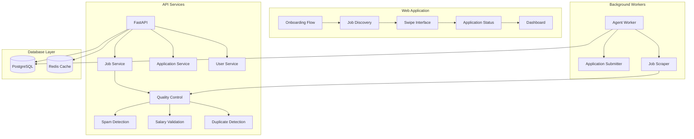

# Job Application Automation System - Implementation Plan

Based on the comprehensive audit, this plan outlines the phased implementation of improvements across the system.

## Success Metrics Targets

| Metric | Current | Target |
|--------|---------|--------|
| Onboarding completion | ~60% | 85%+ |
| Application success rate | ~70% | 80%+ |
| User engagement | ~2 sessions/week | 4+ sessions/week |
| API response time | - | <200ms for job queries |
| System uptime | - | 99.9%+ |
| Error rate | - | <1% for critical operations |

---

## PHASE 1: Job Quality Control System

### 1.1 Spam Detection for Job Listings
**Location**: `packages/backend/domain/`
**Implementation**:
- Add spam detection module with patterns for:
  - Suspicious company names (random letter combinations, "too good to be true")
  - Keyword stuffing in descriptions
  - Excessive caps/all caps titles
  - Common scam phrases
- Integrate into job ingestion pipeline
- Add `is_spam` flag to jobs table

### 1.2 Salary Validation
**Location**: `packages/backend/services/`
**Implementation**:
- Create salary validation service
- Compare reported salaries against market rates by role/location
- Flag salaries that exceed 3 standard deviations from median
- Add `salary_validation_flags` JSONB field to jobs table
- Add warning badges on UI for validated salaries

### 1.3 Duplicate Job Detection
**Location**: `packages/backend/services/`
**Implementation**:
- Create similarity detection using:
  - Title + company hash matching
  - Description similarity (Levenshtein distance)
  - URL normalization
- Add deduplication worker that runs periodically
- Add `canonical_job_id` reference to jobs table

### 1.4 Company Verification/Scoring
**Location**: `packages/backend/domain/companies.py`
**Implementation**:
- Create company verification service:
  - Domain existence check
  - LinkedIn company page validation
  - Number of employees verification
  - Industry classification
- Add company reputation scoring algorithm
- Create `companies` table for tracking verified entities

---

## PHASE 2: Onboarding Streamlining

### 2.1 Streamline to 4 Essential Steps
**Location**: `apps/web/src/pages/app/onboarding/`
**Current Steps**: 8 (Welcome → Resume → Career Goals → Skill Review → Work Style → Preferences → Confirm Contact → Ready)
**Proposed Steps**: 4 (Welcome → Resume/Experience → Preferences → Ready)

**Implementation**:
- Merge Career Goals + Skill Review + Work Style into single "Experience" step
- Merge Preferences step with reduced fields
- Add smart defaults based on common patterns
- Preserve all data collection, reorganize UI flow

### 2.2 Add DOC/DOCX Resume Support
**Location**: `apps/web/src/lib/fileValidation.ts`
**Implementation**:
- Add `.doc` and `.docx` MIME types to allowed list
- Integrate docx parsing library (e.g., `mammoth`)
- Add validation for file structure
- Update error messages

### 2.3 Skip Option for Experienced Users
**Location**: `apps/web/src/pages/app/onboarding/steps/`
**Implementation**:
- Add "Skip for now" buttons on non-critical steps
- Store skipped steps in user preferences
- Allow completion of skipped steps later in Settings
- Add "Quick setup" alternative flow

### 2.4 Value Proposition Messaging
**Location**: `apps/web/src/pages/app/onboarding/`
**Implementation**:
- Add benefit highlights on Welcome step:
  - "Apply to 10x more jobs in less time"
  - "AI-powered matching with your skills"
  - "Track all applications in one place"
- Add progress indicator with time estimate
- Add social proof (e.g., "10,000+ jobs applied this week")

---

## PHASE 3: Application Transparency

### 3.1 Real-time Application Status Updates
**Location**: `apps/web/src/hooks/useApplications.ts`, WebSocket server
**Implementation**:
- Add WebSocket connection for real-time updates
- Define status states: SAVED → APPLYING → SUBMITTED → VIEWED → REJECTED → OFFER
- Add polling fallback for WebSocket failures
- Show last updated timestamp on dashboard

### 3.2 Detailed Failure Explanations
**Location**: `apps/worker/agent.py`, `apps/api/`
**Implementation**:
- Expand error logging in application worker
- Create error categorization (CAPTCHA, FORM_CHANGE, RATE_LIMIT, LOGIN_REQUIRED, UNKNOWN)
- Return human-readable error messages to frontend
- Add "Troubleshooting" link for common failures

### 3.3 Success Celebration/Feedback
**Location**: `apps/web/src/hooks/useCelebrations.ts`
**Implementation**:
- Add confetti animation on successful submission
- Add "Application Sent!" notification
- Show estimated response time based on company
- Add "Share your success" option

### 3.4 Hold Question Notifications
**Location**: `apps/web/src/pages/dashboard/HoldsView.tsx`
**Implementation**:
- Add push notifications for hold questions requiring action
- Add email notifications for urgent holds
- Show deadline countdown for time-sensitive questions
- Add "Quick answer" inline form

---

## PHASE 4: Dashboard Redesign

### 4.1 Clear Metrics Hierarchy
**Location**: `apps/web/src/pages/dashboard/Dashboard.tsx`
**Implementation**:
- Top row: Key metrics (Applications sent, Response rate, Interviews scheduled)
- Second row: Quick actions (New jobs, Continue applications, Pending questions)
- Third row: Recent activity feed
- Fourth row: Pipeline overview

### 4.2 Pipeline Visualization
**Location**: `apps/web/src/pages/app/pipeline-view/`
**Implementation**:
- Create Kanban-style pipeline: SAVED → APPLYING → SUBMITTED → VIEWED → RESPONDING → INTERVIEW → OFFER → REJECTED
- Add drag-and-drop between stages
- Show count badges on each stage
- Add filter by date range, company, position

### 4.3 Historical Trend Data
**Location**: `apps/web/src/pages/dashboard/`
**Implementation**:
- Add charts for:
  - Applications over time (line chart)
  - Success rate by week/month (bar chart)
  - Top companies applied to (pie chart)
  - Response time trends
- Add date range selector (7 days, 30 days, 90 days, all time)

### 4.4 Bulk Application Management
**Location**: `apps/web/src/pages/dashboard/ApplicationsView.tsx`
**Implementation**:
- Add multi-select with checkboxes
- Bulk actions: Delete, Save, Archive, Change status
- Bulk apply to multiple similar jobs
- Export selected applications to CSV

---

## PHASE 5: Database Schema Enhancements

### 5.1 Quality Control Fields
**Migration**: `migrations/035_job_quality_fields.sql`
```sql
ALTER TABLE jobs ADD COLUMN is_spam BOOLEAN DEFAULT FALSE;
ALTER TABLE jobs ADD COLUMN spam_score FLOAT;
ALTER TABLE jobs ADD COLUMN salary_validated BOOLEAN;
ALTER TABLE jobs ADD COLUMN salary_validation_notes TEXT;
ALTER TABLE jobs ADD COLUMN canonical_job_id UUID REFERENCES jobs(id);
ALTER TABLE jobs ADD COLUMN company_score FLOAT;
ALTER TABLE jobs ADD COLUMN quality_flags JSONB;
```

### 5.2 Analytics Tables
**Migration**: `migrations/036_analytics_tables.sql`
```sql
CREATE TABLE user_events (
  id UUID PRIMARY KEY,
  user_id UUID REFERENCES users(id),
  event_type VARCHAR(100),
  metadata JSONB,
  created_at TIMESTAMP DEFAULT CURRENT_TIMESTAMP
);

CREATE TABLE job_views (
  id UUID PRIMARY KEY,
  user_id UUID REFERENCES users(id),
  job_id UUID REFERENCES jobs(id),
  duration_seconds INTEGER,
  created_at TIMESTAMP DEFAULT CURRENT_TIMESTAMP
);

CREATE TABLE application_outcomes (
  id UUID PRIMARY KEY,
  application_id UUID REFERENCES applications(id),
  status VARCHAR(50),
  response_time_days INTEGER,
  notes TEXT,
  created_at TIMESTAMP DEFAULT CURRENT_TIMESTAMP
);
```

### 5.3 User Behavior Tracking
**Migration**: `migrations/037_behavior_tracking.sql`
```sql
CREATE TABLE swipe_events (
  id UUID PRIMARY KEY,
  user_id UUID REFERENCES users(id),
  job_id UUID REFERENCES jobs(id),
  action VARCHAR(20), -- 'save', 'skip', 'apply'
  match_score FLOAT,
  created_at TIMESTAMP DEFAULT CURRENT_TIMESTAMP
);

CREATE TABLE skill_gaps (
  id UUID PRIMARY KEY,
  user_id UUID REFERENCES users(id),
  job_id UUID REFERENCES jobs(id),
  missing_skills JSONB,
  matched_skills JSONB,
  gap_score FLOAT,
  created_at TIMESTAMP DEFAULT CURRENT_TIMESTAMP
);
```

---

## PHASE 6: API Standardization

### 6.1 Standardize Response Formats
**Location**: `api/` - Create middleware for consistent responses
```python
# Standard response wrapper
{
  "success": boolean,
  "data": any,
  "error": {
    "code": string,
    "message": string
  },
  "meta": {
    "timestamp": datetime,
    "version": string
  }
}
```

### 6.2 Field Naming Conventions
**Location**: `packages/backend/models/`
- Use snake_case for all API fields
- Create mapping layer for legacy fields
- Document field naming standards

### 6.3 Standardize Error Responses
**Location**: `api/exceptions/`
- Create custom exception classes
- Define error code enumeration
- Add error handling middleware

### 6.4 Rate Limiting on AI Endpoints
**Location**: `api/middleware/rate_limit.py`
- Add rate limiting per user/tenant
- Different limits for AI vs. standard endpoints
- Add rate limit headers to responses

---

## PHASE 7: Frontend Performance

### 7.1 Fix Excessive Re-renders
**Location**: `apps/web/src/`
- Add React.memo to expensive components
- Implement useMemo/useCallback appropriately
- Use virtualization for long lists
- Add shouldComponentUpdate where needed

### 7.2 Memory Leak Fixes
**Location**: `apps/web/src/hooks/`
- Add cleanup functions for subscriptions
- Implement proper event listener cleanup
- Use AbortController for async operations
- Add memory usage monitoring

### 7.3 Caching Strategy
**Location**: `apps/web/src/lib/`
- Implement stale-while-revalidate for job lists
- Add Redis caching on backend
- Cache user preferences locally
- Implement ETags for conditional requests

### 7.4 Error Boundaries
**Location**: `apps/web/src/`
- Add ErrorBoundary components
- Create fallback UI for AI failures
- Add retry logic with exponential backoff
- Log errors to monitoring service

---

## PHASE 8: Analytics & Insights

### 8.1 User Behavior Tracking
**Implementation**:
- Track swipe patterns (left/right ratios, time to decide)
- Track session duration and frequency
- Track feature usage patterns
- Create user engagement scoring

### 8.2 Job View Duration Analytics
**Implementation**:
- Record time spent on job details
- Correlate with application decisions
- Identify high-engagement job characteristics

### 8.3 Skill Gap Analytics
**Implementation**:
- Compare user skills to job requirements
- Identify trending skills in job market
- Recommend skill improvements

### 8.4 Career Progression Data
**Implementation**:
- Track role changes over time
- Track salary progression
- Track industry transitions

---

## PHASE 9: Security & Compliance

### 9.1 GDPR Compliance
**Implementation**:
- Add data export functionality
- Add data deletion (right to be forgotten)
- Add data processing consent
- Add data retention settings

### 9.2 Data Retention Policies
**Implementation**:
- Define retention periods by data type
- Add automated cleanup jobs
- Add user-facing retention settings

### 9.3 User Consent Management
**Implementation**:
- Add consent checkboxes for:
  - Email communications
  - Data analytics
  - Marketing updates
- Store consent records with timestamps

### 9.4 User Reporting System
**Location**: `apps/web/src/pages/app/`
**Implementation**:
- Add "Report this job" button on job cards
- Create reporting form with categories:
  - Spam/Scam
  - Fake job posting
  - Misleading information
  - Inappropriate content
- Add admin dashboard for reported jobs

### 9.5 Human Review Workflow
**Implementation**:
- Create queue for flagged content
- Add admin review interface
- Add automated scoring for priority
- Add resolution tracking

---

## Architecture Diagram



---

## Priority Recommendations

### Immediate (Week 1-2)
1. Job quality control system (biggest user impact)
2. Onboarding streamlining (improve conversion)
3. Real-time application updates (transparency)

### Short-term (Week 3-4)
4. Dashboard redesign
5. Error handling improvements
6. Performance optimizations

### Medium-term (Week 5-6)
7. Analytics implementation
8. GDPR compliance
9. Advanced features

### Long-term (Week 7+)
10. Enterprise features
11. Advanced AI enhancements
12. API integrations

---

## Dependencies Between Phases

- Phase 5 (Database Schema) should begin early as other phases depend on new fields
- Phase 1 (Quality Control) should be early as it affects job data used throughout
- Phase 6 (API Standardization) should be done before Phase 4 (Dashboard) frontend work
- Phase 9 (Security) should run in parallel with other phases
