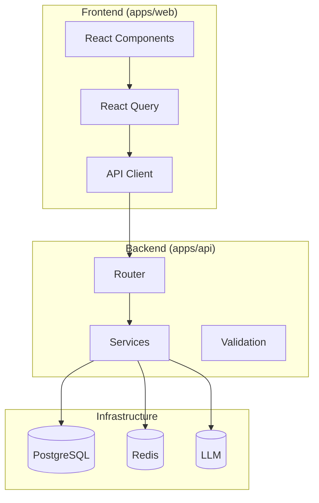

# JobHuntin - Phases 6-9 Comprehensive Implementation Plan

## Executive Summary

This document outlines the implementation plan for Phases 6-9 of the JobHuntin platform:
- **Phase 6**: API Standardization
- **Phase 7**: Frontend Performance  
- **Phase 8**: Analytics & Insights
- **Phase 9**: Security & Compliance

Additionally, this plan identifies and addresses cross-cutting concerns including frontend-backend integration issues, system reliability, and user experience improvements.

---

## System Architecture Overview



---

## Phase 6: API Standardization

### 6.1 Standardize API Response Formats

**Current State**: Inconsistent response formats across 60+ endpoints
- Some return `{success, data}`, others return raw objects
- Error responses vary in structure

**Implementation Tasks**:
- [ ] Create standard response wrapper in `shared/api_response.py`
- [ ] Define SuccessResponse and ErrorResponse Pydantic models
- [ ] Add response middleware for automatic wrapping
- [ ] Audit all endpoints and update to use standard format
- [ ] Add deprecation notices for old formats

**Target Format**:
```json
{
  "success": true,
  "data": { ... },
  "meta": {
    "version": "1.0",
    "timestamp": "2026-03-13T12:00:00Z"
  }
}
```

### 6.2 Standardize Field Naming Conventions

**Current State**: Mixed snake_case (Python) and camelCase (JS)
- Backend uses snake_case (user_id, job_id)
- Frontend expects various formats
- Inconsistent in API responses

**Implementation Tasks**:
- [ ] Create field naming convention config
- [ ] Implement automatic snake_case → camelCase transformation
- [ ] Add response transformation middleware
- [ ] Document naming conventions in API spec
- [ ] Update frontend type definitions to match

### 6.3 Implement Consistent Error Handling Patterns

**Current State**: Inconsistent error responses
- Various HTTP status codes used differently
- Error messages vary in detail level
- No standardized error codes

**Implementation Tasks**:
- [ ] Create error code enum in `shared/errors.py`
- [ ] Define standard error response format
- [ ] Implement custom exception classes
- [ ] Add global exception handler middleware
- [ ] Add error code documentation
- [ ] Ensure all 400+ HTTPException uses consistent format

**Target Error Format**:
```json
{
  "success": false,
  "error": {
    "code": "VALIDATION_ERROR",
    "message": "Invalid email format",
    "details": [...],
    "request_id": "req_abc123"
  }
}
```

### 6.4 Review and Enhance Rate Limiting

**Current State**: Advanced rate limiter exists in `shared/api_rate_limiter.py`
- Token bucket, sliding window, fixed window strategies
- Per-user, per-IP, per-tenant scopes
- Redis-backed

**Implementation Tasks**:
- [ ] Audit rate limiter configuration
- [ ] Add per-endpoint rate limit rules
- [ ] Implement rate limit response headers consistently
- [ ] Add admin dashboard for rate limit monitoring
- [ ] Test distributed rate limiting
- [ ] Add circuit breaker patterns for rate limiter failures

### 6.5 Add API Versioning Headers and Deprecation

**Current State**: Basic versioning exists, needs enhancement

**Implementation Tasks**:
- [ ] Add standard version header (Accept: application/vnd.jobhuntin.v1+json)
- [ ] Implement deprecation header (Deprecation, Sunset)
- [ ] Create version negotiation middleware
- [ ] Add deprecation schedule to endpoint docs
- [ ] Build version migration guide

---

## Phase 7: Frontend Performance

### 7.1 Audit React Components for Unnecessary Re-renders

**Current State**: Uses React Query, but components may have issues

**Implementation Tasks**:
- [ ] Run React DevTools profiler on key flows
- [ ] Identify components with >10 re-renders
- [ ] Add useMemo/useCallback strategically
- [ ] Implement React.memo for list items
- [ ] Fix prop drilling issues

### 7.2 Implement Proper Memoization Strategies

**Implementation Tasks**:
- [ ] Audit computed values that could be memoized
- [ ] Add useMemo for expensive calculations
- [ ] Add useCallback for event handlers passed to children
- [ ] Implement selectors for derived state

### 7.3 Review and Fix Potential Memory Leaks

**Current State**: No known memory leak audits

**Implementation Tasks**:
- [ ] Audit setTimeout/setInterval usage
- [ ] Check event listener cleanup in useEffect
- [ ] Verify subscription cleanup (WebSocket, SSE)
- [ ] Check component unmount cleanup
- [ ] Add memory leak detection in development

### 7.4 Enhance Caching Strategy (React Query)

**Current State**: React Query is used extensively
- 20+ useQuery hooks across the app
- Basic staleTime configured

**Implementation Tasks**:
- [ ] Configure QueryClient with optimal defaults
- [ ] Add staleTime based on data volatility
- [ ] Implement cache invalidation strategies
- [ ] Add prefetching for likely navigation
- [ ] Implement infinite query for lists
- [ ] Add optimistic updates for mutations

### 7.5 Strengthen Error Boundaries and Recovery

**Current State**: ErrorBoundary component exists

**Implementation Tasks**:
- [ ] Add error boundary per feature area
- [ ] Implement retry with exponential backoff
- [ ] Add error state UI components
- [ ] Implement fallback for network errors
- [ ] Add global error tracking integration

---

## Phase 8: Analytics & Insights

### 8.1 Review Existing Analytics Endpoints Integration

**Current State**: Multiple analytics endpoints exist:
- `user_behavior_endpoints.py` - User behavior tracking
- `ui_analytics_endpoints.py` - UI analytics
- `ux_metrics_endpoints.py` - UX metrics

**Implementation Tasks**:
- [ ] Audit all analytics endpoints
- [ ] Verify data flow to frontend
- [ ] Check data aggregation logic
- [ ] Test real-time analytics
- [ ] Add missing analytics events

### 8.2 Implement Comprehensive User Behavior Tracking

**Implementation Tasks**:
- [ ] Define key user journey events
- [ ] Implement funnel tracking
- [ ] Add session recording metadata
- [ ] Track user engagement metrics
- [ ] Add conversion tracking
- [ ] Implement retention analytics

### 8.3 Add Skill Gap Analysis Features

**Implementation Tasks**:
- [ ] Create skill gap analysis endpoint
- [ ] Implement job-market skill comparison
- [ ] Add skill recommendation engine
- [ ] Build skill progress tracking
- [ ] Add learning resource recommendations

### 8.4 Build Analytics Dashboard Components

**Implementation Tasks**:
- [ ] Create analytics overview cards
- [ ] Implement chart components
- [ ] Build funnel visualization
- [ ] Add export functionality
- [ ] Implement date range filtering
- [ ] Create dashboard layout

---

## Phase 9: Security & Compliance

### 9.1 Review and Enhance GDPR Implementation

**Current State**: GDPR endpoints exist in `apps/api/gdpr.py`
- Data export endpoint
- Data deletion endpoint
- CCPA compliance

**Implementation Tasks**:
- [ ] Audit GDPR endpoint coverage
- [ ] Test data export for all data types
- [ ] Verify complete data deletion
- [ ] Add audit logging for GDPR requests
- [ ] Implement 30-day deletion window
- [ ] Add data portability format options

### 9.2 Implement Data Retention Policies

**Implementation Tasks**:
- [ ] Define retention periods per data type
- [ ] Create automated cleanup jobs
- [ ] Implement archival for historical data
- [ ] Add retention policy configuration
- [ ] Build retention dashboard for admins

### 9.3 Build Consent Management System

**Current State**: CookieConsent component exists
- Essential/Analytics/Marketing categories
- LocalStorage-based

**Implementation Tasks**:
- [ ] Sync consent to backend database
- [ ] Add consent versioning
- [ ] Implement consent audit log
- [ ] Build consent preference center
- [ ] Add granular consent options
- [ ] Implement consent-based data processing

### 9.4 Add Reporting System for Compliance

**Implementation Tasks**:
- [ ] Create compliance dashboard
- [ ] Build data subject request tracker
- [ ] Implement consent reporting
- [ ] Add regulatory report generation
- [ ] Create audit trail viewer

---

## Cross-Cutting Concerns

### C.1 Audit API Client for Compatibility Issues

**Current State**: API client in `apps/web/src/lib/api.ts`
- Retry with exponential backoff
- 401 → redirect to login
- Basic error handling

**Implementation Tasks**:
- [ ] Review error handling coverage
- [ ] Add request/response interceptors
- [ ] Implement type-safe API calls
- [ ] Add request cancellation support
- [ ] Verify CORS configuration

### C.2 Fix TypeScript Type Mismatches

**Implementation Tasks**:
- [ ] Generate TypeScript types from OpenAPI spec
- [ ] Audit API response types
- [ ] Add strict typing to API client
- [ ] Fix enum mismatches
- [ ] Add validation at API boundary

### C.3 Ensure Error Responses are Properly Typed

**Implementation Tasks**:
- [ ] Create error response types
- [ ] Add error handling to API client
- [ ] Implement typed error boundaries
- [ ] Add error-toast integration

### C.4 Review Authentication Flow

**Current State**: JWT + Magic Link auth exists

**Implementation Tasks**:
- [ ] Test token refresh flow
- [ ] Verify session handling
- [ ] Check CSRF implementation
- [ ] Add token rotation
- [ ] Implement secure logout

---

### R.1 Add Retry Logic to Critical Operations

**Implementation Tasks**:
- [ ] Review current retry implementation
- [ ] Add retry for mutation failures
- [ ] Implement idempotency keys
- [ ] Add optimistic rollback

### R.2 Implement Circuit Breakers

**Current State**: Circuit breaker exists in `shared/circuit_breaker.py`

**Implementation Tasks**:
- [ ] Audit circuit breaker usage
- [ ] Add circuit breakers for external APIs
- [ ] Implement fallback behaviors
- [ ] Add circuit breaker monitoring

### R.3 Add Loading States Across UI

**Implementation Tasks**:
- [ ] Audit all async operations
- [ ] Add loading skeletons
- [ ] Implement skeleton components
- [ ] Add progress indicators
- [ ] Create loading state patterns

### R.4 Review Race Conditions

**Implementation Tasks**:
- [ ] Audit concurrent state updates
- [ ] Fix optimistic update conflicts
- [ ] Implement optimistic locking
- [ ] Add transaction support

---

### U.1 Audit Navigation and Routing

**Implementation Tasks**:
- [ ] Check route definitions
- [ ] Add route guards
- [ ] Implement lazy loading
- [ ] Add breadcrumbs
- [ ] Improve URL structure

### U.2 Improve Form Validation Feedback

**Implementation Tasks**:
- [ ] Standardize validation messages
- [ ] Add inline validation
- [ ] Implement field-level errors
- [ ] Add form submission feedback

### U.3 Add Empty States and Loading Skeletons

**Implementation Tasks**:
- [ ] Create empty state components
- [ ] Add skeleton components
- [ ] Implement loading patterns
- [ ] Add placeholder content

### U.4 Review Mobile Responsiveness

**Implementation Tasks**:
- [ ] Test all pages on mobile
- [ ] Fix layout issues
- [ ] Optimize touch interactions
- [ ] Add responsive navigation

---

## Implementation Priority Matrix

| Priority | Task | Complexity | Dependencies |
|----------|------|------------|--------------|
| P0 | API response standardization | Medium | None |
| P0 | Error handling consistency | Medium | None |
| P0 | Error boundary enhancement | Low | None |
| P1 | React Query optimization | Medium | None |
| P1 | Consent backend sync | Medium | GDPR |
| P1 | TypeScript integration | High | API standardization |
| P2 | Analytics dashboard | Medium | Analytics endpoints |
| P2 | Data retention policies | Medium | GDPR |
| P2 | Performance audit | Medium | None |
| P3 | Mobile responsiveness | Low | None |

---

## Technical Debt Identified

1. **838 ruff errors** - Pre-existing lint issues
2. **351 mypy errors** - Pre-existing type issues
3. **Inconsistent error handling** - 300+ HTTPException usages
4. **Mixed field naming** - snake_case vs camelCase
5. **No API documentation** - OpenAPI spec incomplete
6. **Consent not persisted** - LocalStorage only
7. **Memory leak potential** - Event listeners, timers
8. **No real-time updates** - Polling only

---

## Success Metrics

- All API responses follow standard format
- Error responses have consistent structure
- React Query cache hit rate > 80%
- Zero memory leaks detected
- GDPR requests processed within 30 days
- Consent preferences synced to backend
- Analytics tracking 100% of key events
- Mobile Lighthouse score > 90

---

## Recommended Execution Order

1. **Week 1-2**: API Standardization (6.1-6.3)
2. **Week 3**: Rate Limiting & Versioning (6.4-6.5)
3. **Week 4**: Frontend Performance Audit (7.1-7.3)
4. **Week 5**: React Query & Error Boundaries (7.4-7.5)
5. **Week 6**: Analytics Integration (8.1-8.2)
6. **Week 7**: Analytics Dashboard (8.3-8.4)
7. **Week 8**: GDPR Enhancement (9.1-9.2)
8. **Week 9**: Consent Management (9.3)
9. **Week 10**: Compliance Reporting (9.4)
10. **Ongoing**: Cross-cutting concerns
