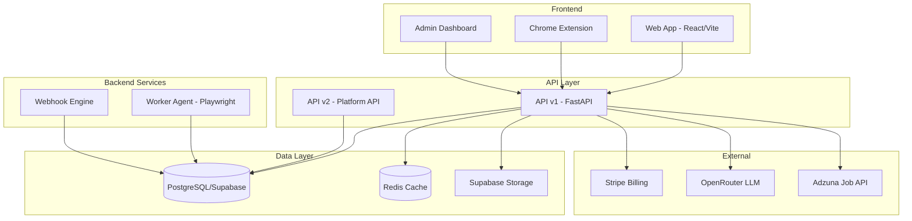

# System Architecture & API Structure Audit Report

**Audit Date:** 2026-02-09  
**Scope:** Architecture-related code analysis for end-to-end user journey audit  
**Status:** Complete

---

## Executive Summary

This audit covers the system architecture and API structure of the Sorce/JobHuntin platform. The codebase demonstrates a well-organized multi-tier architecture with clear separation between API versions, backend modules, and frontend components. However, several areas require attention for improved maintainability, security, and scalability.

### Architecture Overview



---

## Findings by Category

### CRITICAL Issues

#### 1. **Missing redis Package in requirements.txt**
- **File:** [`requirements.txt`](requirements.txt:20)
- **Issue:** Line 20 contains corrupted text `redis>=5.0.0` with spacing issues - appears as `redis>=5.0.0r e d i s >= 5 . 0 . 0`
- **Impact:** Redis package may not install correctly, causing runtime failures
- **Recommendation:** Fix the line to properly read `redis>=5.0.0`

#### 2. **Duplicate Route Definition in render.yaml**
- **File:** [`render.yaml`](render.yaml:175)
- **Issue:** Lines 174-175 contain duplicate `destination: /index.html` entry
- **Impact:** YAML parsing may fail or behave unexpectedly
- **Recommendation:** Remove duplicate line

#### 3. **Extension Background Worker is Empty**
- **File:** [`apps/extension/src/background/index.ts`](apps/extension/src/background/index.ts:1)
- **Issue:** Background worker only contains a console.log statement
- **Impact:** Extension cannot handle messages from content script; `JOB_DETECTED` messages are lost
- **Recommendation:** Implement message handler to process job data and communicate with API

---

### MAJOR Issues

#### 4. **Inconsistent Dependency Injection Pattern**
- **Files:** Multiple API modules
- **Issue:** Each module uses generator-based stub functions that throw errors:
  ```python
  def _get_pool() -> asyncpg.Pool:
      return (_ for _ in ()).throw(NotImplementedError("Pool not injected"))
  ```
- **Locations:**
  - [`apps/api/analytics.py:37-40`](apps/api/analytics.py:37)
  - [`apps/api/bulk.py:29-32`](apps/api/bulk.py:29)
  - [`apps/api/developer.py:24-27`](apps/api/developer.py:24)
  - [`apps/api/marketplace.py:25-28`](apps/api/marketplace.py:25)
- **Impact:** Confusing pattern; errors only at runtime if dependency not wired
- **Recommendation:** Use standard `NotImplementedError` raise or FastAPI's dependency injection properly

#### 5. **No Rate Limiting on API v1 Endpoints**
- **File:** [`apps/api/main.py`](apps/api/main.py)
- **Issue:** While API v2 has rate limiting via API keys, v1 endpoints rely only on tenant quotas
- **Impact:** Potential for abuse on public-facing endpoints
- **Recommendation:** Implement request rate limiting middleware for v1 endpoints

#### 6. **Missing Input Validation on OG Image Endpoint**
- **File:** [`apps/api/og.py`](apps/api/og.py:74-80)
- **Issue:** Query parameters have max_length but no sanitization for XSS or injection
- **Impact:** Potential security vulnerability if text is rendered unsafely
- **Recommendation:** Add input sanitization for all text parameters

#### 7. **Webhook Retry Logic Blocks**
- **File:** [`apps/api_v2/webhooks.py`](apps/api_v2/webhooks.py:138-142)
- **Issue:** Retry logic uses `asyncio.sleep()` which blocks the coroutine
- **Impact:** Under high webhook volume, retries could stack up and delay other operations
- **Recommendation:** Use a task queue (e.g., Celery, ARQ) for webhook retries

#### 8. **No Database Migration System**
- **File:** [`apps/api/main.py`](apps/api/main.py:295-315)
- **Issue:** Auto-migrations run on startup via `_run_migrations()` but no versioned migration system
- **Impact:** No rollback capability; difficult to track schema changes
- **Recommendation:** Implement Alembic or similar migration tool

#### 9. **Extension Content Script Limited to LinkedIn**
- **File:** [`apps/extension/manifest.json`](apps/extension/manifest.json:20)
- **Issue:** Content script only matches LinkedIn and Indeed, but Indeed scraper is not implemented
- **Impact:** Extension only works on LinkedIn; Indeed support is declared but missing
- **Recommendation:** Implement Indeed scraper or remove from manifest

---

### MINOR Issues

#### 10. **Hardcoded Stripe Price IDs**
- **File:** [`render.yaml`](render.yaml:36-52)
- **Issue:** Stripe price IDs are hardcoded in render.yaml
- **Impact:** Requires code deployment to change pricing
- **Recommendation:** Use environment variables or database configuration

#### 11. **No API Versioning Strategy Documented**
- **Files:** [`apps/api/main.py`](apps/api/main.py), [`apps/api_v2/router.py`](apps/api_v2/router.py)
- **Issue:** v1 and v2 coexist but no clear migration path or deprecation policy
- **Impact:** Developers may not know which API to use
- **Recommendation:** Document API versioning strategy and deprecation timeline

#### 12. **Inconsistent Error Response Format**
- **Files:** Various API modules
- **Issue:** Some endpoints return `{"detail": "message"}`, others return `ErrorResponse` model
- **Impact:** Frontend must handle multiple error formats
- **Recommendation:** Standardize on `ErrorResponse` envelope across all endpoints

#### 13. **Missing TypeScript Types in Extension**
- **File:** [`apps/extension/src/content/index.ts`](apps/extension/src/content/index.ts:18)
- **Issue:** `chrome.runtime.sendMessage` is called but no type safety on message types
- **Impact:** Potential runtime errors from malformed messages
- **Recommendation:** Define shared TypeScript interfaces for message types

#### 14. **No Circuit Breaker for External Services**
- **Files:** [`apps/api/billing.py`](apps/api/billing.py), [`apps/api/og.py`](apps/api/og.py)
- **Issue:** Direct calls to Stripe, httpx without circuit breaker pattern
- **Impact:** Cascading failures if external services are degraded
- **Recommendation:** Implement circuit breaker for all external service calls

#### 15. **Vite Config Missing Environment Variable Validation**
- **File:** [`apps/web/vite.config.ts`](apps/web/vite.config.ts)
- **Issue:** No validation that required env vars exist at build time
- **Impact:** Build may succeed but runtime failures
- **Recommendation:** Add env var validation plugin

---

## Code Organization Assessment

### Strengths
1. **Clear Module Separation:** API modules are well-organized by domain (billing, admin, analytics, etc.)
2. **Consistent Pydantic Models:** Request/response models are properly defined
3. **Tenant Context Pattern:** Multi-tenancy is handled consistently via `TenantContext`
4. **Audit Logging:** Comprehensive audit events for sensitive operations
5. **Metrics Integration:** Good use of metrics throughout the codebase

### Areas for Improvement
1. **Shared Utilities:** Some serialization helpers are duplicated across modules
2. **Test Coverage:** No test files were analyzed in this audit scope
3. **Documentation:** API endpoints lack comprehensive docstrings

---

## API Versioning Analysis

### Current State
- **API v1:** Main application API at `/` paths, uses JWT auth
- **API v2:** Platform API at `/api/v2`, uses API key auth

### Key Differences

| Feature | API v1 | API v2 |
|---------|--------|--------|
| Authentication | Supabase JWT | API Key |
| Rate Limiting | Tenant quotas | Per-key RPM limits |
| Primary Use | Web app | Integrators/Partners |
| Webhooks | None | Full support |

### Recommendations
1. Document which endpoints should be used by which clients
2. Create migration guide for v1 to v2 transition
3. Consider v1 deprecation timeline

---

## Database/Storage Architecture

### Current Implementation
- **Primary Database:** PostgreSQL via Supabase
- **Connection Pooling:** asyncpg with configurable pool size
- **Read Replicas:** Supported via `read_replica_url` config
- **Object Storage:** Supabase Storage for resumes
- **Caching:** Redis for session/rate limiting

### Schema Management
- Auto-migrations on startup (no versioning)
- Schema files at `infra/supabase/schema.sql` and `migrations.sql`

### Recommendations
1. Implement Alembic for versioned migrations
2. Add database backup/restore procedures
3. Document schema evolution process

---

## Scalability Concerns

### Identified Bottlenecks
1. **Worker Polling:** Worker polls DB for work; consider pg_notify for real-time
2. **Webhook Retries:** Synchronous retries could stack under load
3. **Connection Pool:** Default pool size may be insufficient for high traffic

### Scaling Recommendations
1. **Horizontal API Scaling:** Already supported via stateless design
2. **Worker Scaling:** Multiple workers safe with SKIP LOCKED
3. **Database:** Consider connection pooler (PgBouncer) for high connection counts
4. **Caching:** Expand Redis usage for frequently accessed data

---

## Missing Functionality Analysis

### Declared but Not Implemented
1. **Indeed Scraper:** Listed in manifest but no implementation
2. **Background Worker Message Handling:** Extension receives but doesn't process messages
3. **Glassdoor Support:** In host_permissions but no content script

### Partially Implemented
1. **Staffing API:** Basic structure exists but candidate submission loop is simplified
2. **Marketplace Payouts:** Schema exists but payout processing not visible

---

## Technical Debt Summary

| Area | Debt Level | Priority |
|------|------------|----------|
| Dependency Injection Pattern | Medium | P2 |
| Migration System | High | P1 |
| Rate Limiting | Medium | P2 |
| Extension Background Worker | High | P1 |
| Error Response Standardization | Low | P3 |
| Circuit Breakers | Medium | P2 |

---

## Recommended Development Tasks

### Priority 1 - Critical
1. Fix `requirements.txt` redis package declaration
2. Remove duplicate line in `render.yaml`
3. Implement extension background worker message handling
4. Implement versioned database migrations

### Priority 2 - Important
1. Standardize dependency injection pattern across modules
2. Add rate limiting to API v1 endpoints
3. Implement circuit breaker for external services
4. Add input sanitization to OG image endpoint

### Priority 3 - Enhancement
1. Document API versioning strategy
2. Standardize error response format
3. Add TypeScript types for extension messages
4. Implement Indeed scraper or remove from manifest

---

## File Reference Index

### API Structure
- [`apps/api/main.py`](apps/api/main.py) - Main FastAPI application, lifespan management, router mounting
- [`apps/api_v2/router.py`](apps/api_v2/router.py) - Platform API v2 endpoints
- [`apps/api_v2/openapi.yaml`](apps/api_v2/openapi.yaml) - OpenAPI 3.1 specification
- [`apps/api_v2/webhooks.py`](apps/api_v2/webhooks.py) - Webhook delivery engine

### Backend Modules
- [`apps/api/admin.py`](apps/api/admin.py) - Admin operations
- [`apps/api/analytics.py`](apps/api/analytics.py) - Analytics and dashboards
- [`apps/api/billing.py`](apps/api/billing.py) - Stripe integration
- [`apps/api/bulk.py`](apps/api/bulk.py) - Bulk campaign operations
- [`apps/api/developer.py`](apps/api/developer.py) - API key management
- [`apps/api/export.py`](apps/api/export.py) - Data export
- [`apps/api/growth.py`](apps/api/growth.py) - Referrals and notifications
- [`apps/api/marketplace.py`](apps/api/marketplace.py) - Blueprint marketplace
- [`apps/api/og.py`](apps/api/og.py) - Open Graph image generation
- [`apps/api/user.py`](apps/api/user.py) - User-facing endpoints

### Infrastructure
- [`docker-compose.yml`](docker-compose.yml) - Local development setup
- [`Dockerfile`](Dockerfile) - Multi-stage build for API/Worker
- [`vercel.json`](vercel.json) - SPA routing configuration
- [`render.yaml`](render.yaml) - Render deployment configuration
- [`requirements.txt`](requirements.txt) - Python dependencies
- [`pyproject.toml`](pyproject.toml) - Project configuration

### Frontend
- [`apps/web/src/App.tsx`](apps/web/src/App.tsx) - React Router configuration
- [`apps/web/src/lib/api.ts`](apps/web/src/lib/api.ts) - API client with auth
- [`apps/web/vite.config.ts`](apps/web/vite.config.ts) - Build configuration

### Extension
- [`apps/extension/manifest.json`](apps/extension/manifest.json) - Chrome extension manifest
- [`apps/extension/src/background/index.ts`](apps/extension/src/background/index.ts) - Background worker
- [`apps/extension/src/content/index.ts`](apps/extension/src/content/index.ts) - Content script

---

*End of Audit Report*
